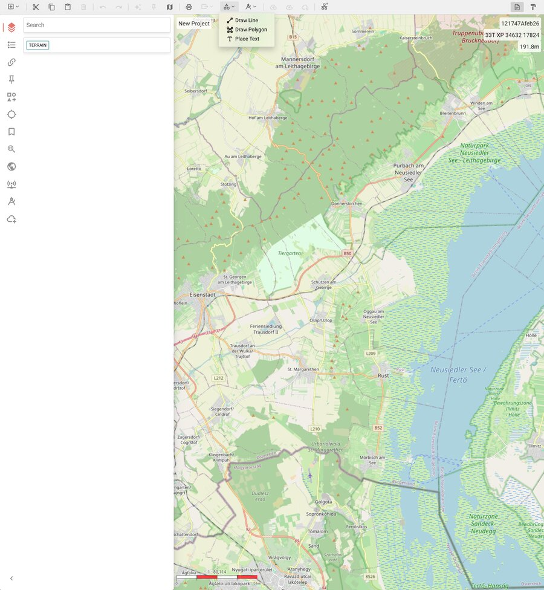
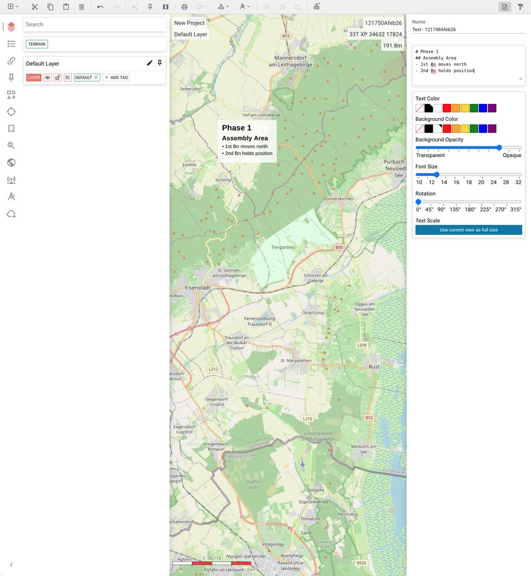

# Shapes — Lines, Polygons, and Text

ODIN supports custom shapes that are not part of the military symbology standard.
These are plain geometric features — lines, polygons, and text labels — that you can
freely place on the map and style to your liking.

## Drawing Shapes

All shape tools are available from the **Shapes dropdown** in the toolbar
(the icon with the geometric shape outline).


*The Shapes dropdown offers three drawing tools: Line, Polygon, and Text.*

### Drawing a Line

1. Click the **Shapes** dropdown in the toolbar.
2. Select **Draw Line**.
3. Click on the map to place each vertex of the line.
4. **Double-click** to finish the line.

The line appears with a default black stroke (width 2).

### Drawing a Polygon

1. Click the **Shapes** dropdown in the toolbar.
2. Select **Draw Polygon**.
3. Click on the map to place each vertex of the polygon.
4. **Double-click** to close and finish the polygon.

The polygon appears with a black outline and no fill by default.

### Placing Text

1. Click the **Shapes** dropdown in the toolbar.
2. Select **Place Text**.
3. Click on the map where you want the text to appear.

A text label reading "Text" is placed at the clicked position.
You can immediately edit it in the properties panel.

## Editing Shapes

Select any shape on the map or in the sidebar to open its **Properties Panel**.

### Line Properties

| Property | Description |
|---|---|
| **Line Color** | Color of the line stroke. Choose from the palette or leave undefined. |
| **Line Width** | Thickness from S (1px) to XXXL (6px). |
| **Line Style** | Solid, Dashed, or Dotted. |

### Polygon Properties

Polygons have all the line properties above, plus:

| Property | Description |
|---|---|
| **Fill Color** | Interior fill color. Leave undefined for no fill. |
| **Fill Opacity** | Transparency of the fill, from 0 (transparent) to 1 (opaque). |

### Text Properties

The text properties panel has two sections:

#### Text Input

A text area where you can type or paste your content.
A simple **Markdown** dialect is supported:

```
# Heading
## Subheading
- Bullet point
* Another bullet point
Plain text on multiple lines
```

- `#` creates a large, bold heading
- `##` creates a medium, bold subheading
- `-` or `*` at the start of a line creates a bullet list item
- Everything else is rendered as plain text


*A text shape using markdown for structured annotations. The properties panel on the right shows the text input and style options.*

#### Style Options

| Property | Description |
|---|---|
| **Text Color** | Color of the text. Default: black. |
| **Background Color** | Color of the text box background. Default: white. |
| **Background Opacity** | Transparency of the background, from 0 (fully transparent) to 1 (opaque). Default: 0.8. |
| **Font Size** | Base font size from 10px to 32px. Headings scale proportionally. |
| **Rotation** | Rotate the text label from 0° to 359°. Use the slider for fine control. |
| **Text Scale** | Click **"Use current view as full size"** to set the current zoom level as the reference. The text will appear at full size at this zoom level and shrink proportionally when zoomed out. |

## Zoom Behavior (Text)

Text labels scale with the map zoom level:

- At the **reference zoom** (set when the text was created, or adjusted via the button),
  the text appears at full size.
- When **zooming out**, the text shrinks proportionally so it does not cover the map.
- The text never shrinks below 15% of its original size.
- When **zooming in** beyond the reference level, the text stays at full size
  (it does not grow larger).

This ensures text labels are readable at the zoom level they were designed for,
without cluttering the map at overview zoom levels.

## Sidebar Tags

Shapes are tagged in the sidebar for easy filtering:

- **SHAPE** — all shape features
- **LINE** — line shapes
- **POLYGON** — polygon shapes
- **TEXT** — text shapes

Use the tag search to quickly filter for specific shape types.

## Tips

- **Text as map annotations:** Use text shapes to add context to your map —
  unit names, phase labels, terrain notes, or any free-form information.
- **Transparent backgrounds:** Set background opacity to 0 for text that
  floats directly on the map without a box.
- **Rotated labels:** Use rotation to align text with roads, borders, or
  other linear features on the map.
- **Markdown headings:** Use `#` headings for titles and `-` lists for
  structured annotations like task organizations or key terrain lists.
