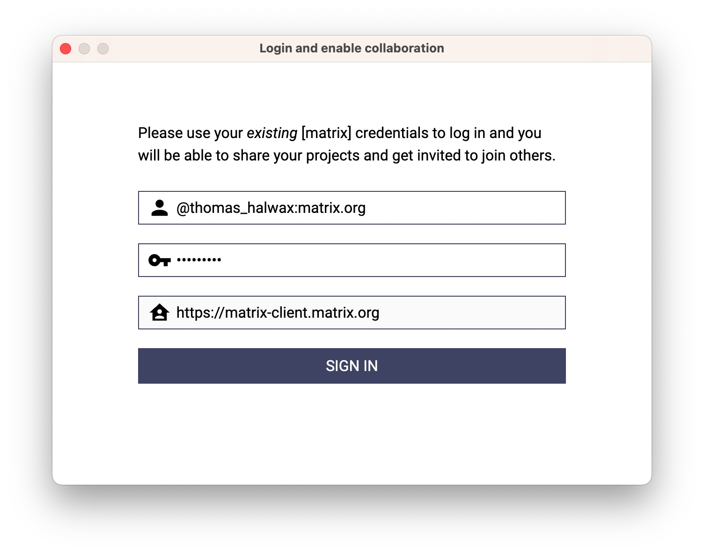
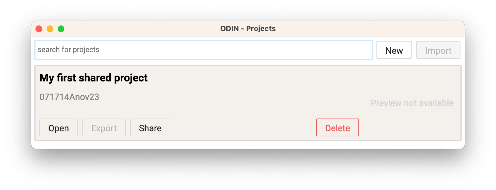
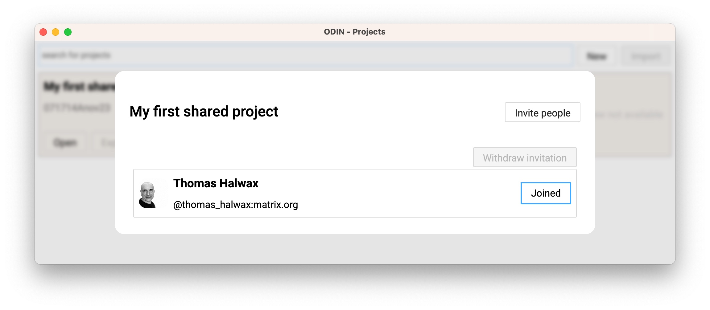
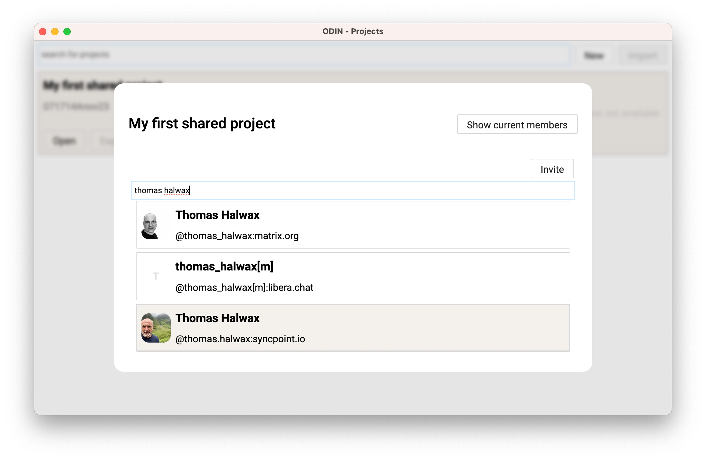

# Replication

> Although Matrix supports end-to-end-encryption ODIN is not capable to handle encrypted messages.

## Prerequisits

### Matrix user account
ODIN uses the [Matrix](https://matrix.org) ecosystem to replicate data between participants. So first of all one needs a valid Matrix user account. Select a Matrix home-server
from the list of [public matrix servers](https://servers.joinmatrix.org), host you own server or just use [matrix.org](https://matrix.org) and register or use your existing matrix account.

> Currently you can not use the same user account on different devices for the same project at the same time! ODIN blocks messages that were sent by the current user!

### Matrix user registration
Since ODIN does not provide a UI to register a new user yet one needs to select a Matrix client to do so. A mature web client is [element web](https://element.io). Open the [element web registration](https://app.element.io/#/register) app and proceed with the matrix server of your choice.

After you managed to create a matrix user we can now start to use ODIN.

## Enable collaboration

After starting ODIN choose `Collaboration > Enable collaboration` and use your matrix credentials. The server URL will be derived from the user id. If this does not work please provide an appropriate URL. If signing-in succeeds the window will close automatically and you can start sharing ODIN projects.

ODIN opens the `Manage projects` page and initializes the replication settings. Depending on the utilization of your home server and your network speed this may take a few seconds (up to 30 seconds or more). 

After you create your first project you are now ready to share it with others.

### Share your project

Just click the `Share` button and wait until it's done. Please be patient since this may also take a while. When ready the `Share` button will disappear and a new `Members` button will show up. Click on the `Members` button to see the current members of the project and to invite people to join.

### Join a project

If others invited you to join a project it will show up in the project management list. Select the project you want to join and click the `Join` button. This initializes a local copy of the project structures but does not retrieve any data yet.

### Manage project membership

The badge on the right side will show the current state auf the person in terms of project membership. The state can either be `JOINED` or `INVITED`. Currently you can not remove joined members from your project. If you select a member who's state is still `INVITED` you may choose `Withdraw invitation` to undo the invitation.

In order to invite people to your project click on `Invite people`. The search input allows you to search the directory of users of your home server. Since it's the choice of the home server
who is listed in the directory you may need to use the fully qualified username `@thomas_halwax:matrix.org` instead of a simple text search like `halwax`.

In order to invite people to your project just select the user entry and click `Invite`. After you finished inviting people you can either go back and `Show current members` or exit the dialog by clicking anywhere outside the dialog window.

## Working with a shared project

> As of Q4/2023 the architecture of ODIN's replication does not limit wat joined members are permitted to do with layers and features. Every member can add and rename layers, add, modify and remove features. The __locked__ state for layers and features affects local manipulation only and is not replicated.
> Future version will support a simple access control (read, read + write) and selective membership management for layers.

> Local changes to shared layers of features are replicated instantly. We try to reach near-realtime replication speed but are limited by the speed of the network used and the utilization of the home server. Since Matrix is a federated system 

No matter if you are the creator of a shared project or you joined one that you have been invited to now's the time to open the project. Select the project and click `Open`. This closes the project management page and opens the project window. Replication for the project gets initialized which may take a few seconds.

Since ODIN uses layers in terms of organizing and structuring features they also play amajor role regarding replication. 
__Your ODIN layers are _local-first_ and must be shared on purpose.__

### Sharing a layer

After you created a new layer you are free to choose to share it immediately or to add features and share it later. The moment you share the layer the current content of the layer will be replicated.

### Receiving invitations to join a layer

Anyone who joined the shared project is able to share their layers. The moment a layer is shared all members of the project will receive a notification (a system notification on Windows and MacOS). Recipients may decide to either ignore the invitation or join the shared layer (it's the same principle like te one we use for projects).

In order to join a shared layer you can either click on the invitation notification or manually switch to the `INVITED` scope. Select a shared layer and click on the `Join` button in the action bar. If you clicked on the invitation notification the layer is already selected.

After joining a shared layer the content will be fetched from the server and get rendered on the map.

### Modifying a shared layer

You are free to change the properties of a shared layer like modifying the layer name or add/remove tags. All these changes will be replicated to others. The __visibility__ (visible, hidden) and the __modification state__ (unlocked, locked) wil __not be replicated__. The same is true for the __DEFAULT__ tag. Those properties are strictly local.

### Deleting a shared layer

When you delete a shared layer you delete the local copy only and leave the shared layer on the server. Others who joined the shared layer are not affected by this action and can still participate.

> There is no way you can re-join a shared layer yet. 

### Adding, modifying and removing content

You can add, modify and remove content to a shared layer at any time. Your changes will be replicated immediatly. Features with a polyline and polygon geometry will replicate on every modification. 

