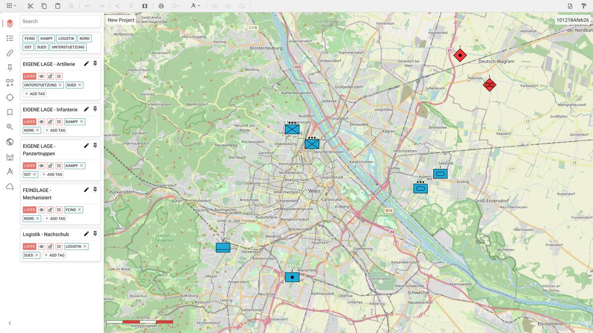
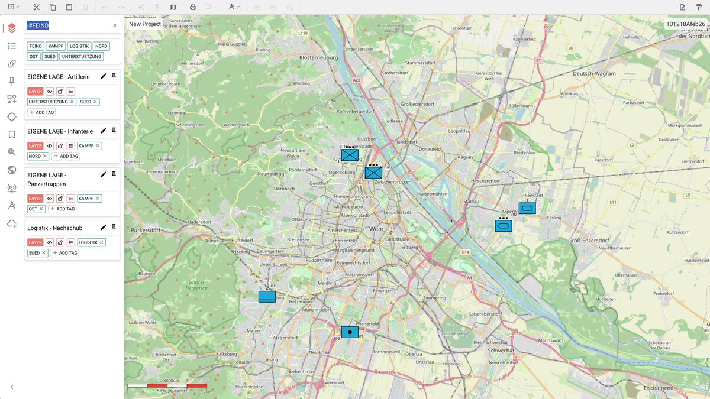
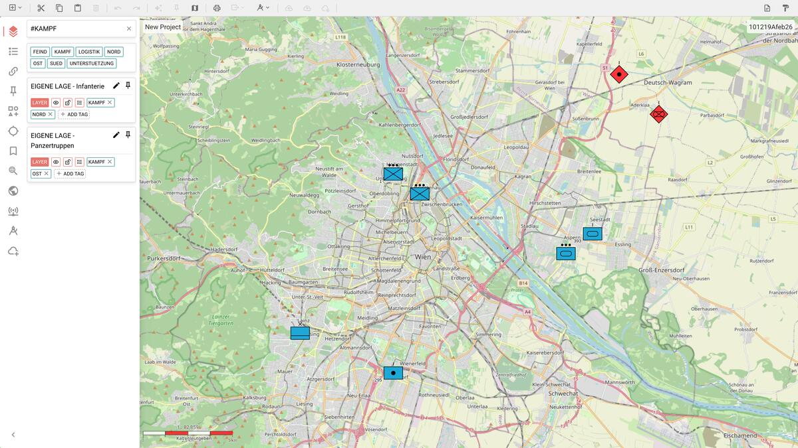
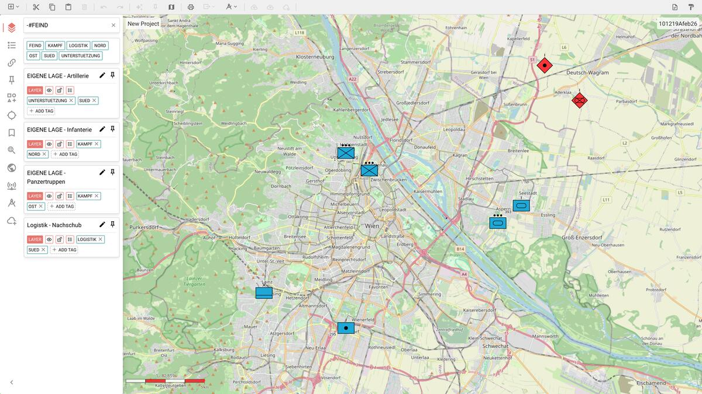
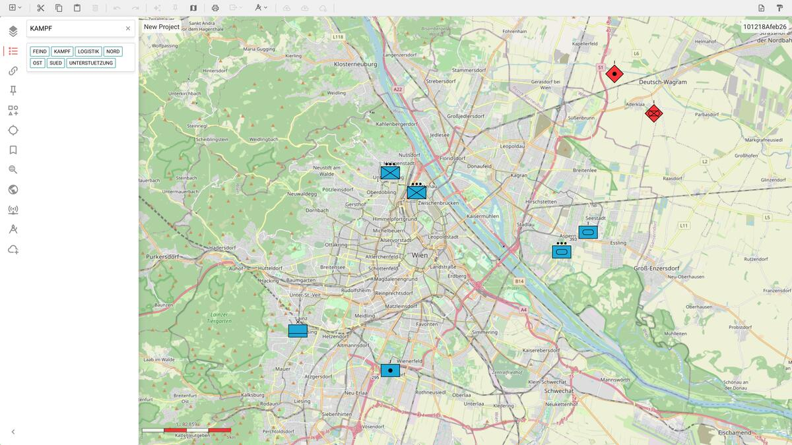

# ODIN — Grundkonzepte

## Was ist ODIN?

ODIN ist ein Open-Source Command and Control Information System (C2IS). Es dient der Lagedarstellung auf digitalen Karten und ermöglicht die Arbeit mit militärischen und zivilen Symbolen nach NATO-Standard (APP-6).

---

## Layer (Ebenen)

**Layer sind die grundlegende Organisationseinheit in ODIN.** Jeder Layer ist ein Container, der Symbole, Grafiken und andere Kartenobjekte (Features) gruppiert.

### Wozu dienen Layer?

- **Thematische Trennung:** Eigene Lage, Feindlage, Logistik, Grenzen — jedes Thema bekommt seinen eigenen Layer.
- **Sichtbarkeit steuern:** Layer können ein- und ausgeblendet werden. Ein Klick auf das Augen-Symbol genügt, um alle Objekte eines Layers auf der Karte sichtbar oder unsichtbar zu machen.
- **Sperren:** Layer lassen sich sperren (Lock), sodass ihre Inhalte nicht versehentlich verändert werden können.
- **Export:** Einzelne Layer können als GeoJSON oder im ODIN-Format exportiert werden.

### Layer in der Praxis

Das folgende Bild zeigt die Layer-Ansicht in der Sidebar. Jeder Layer hat einen Namen, System-Tags (Augen-Icon für Sichtbarkeit, Schloss für Sperrung) und frei vergebene Benutzer-Tags. Die Karte zeigt alle Features im Großraum Wien.



*Fünf Layer in der Sidebar: Artillerie, Infanterie und Panzertruppen (eigene Lage, blau), Feindlage (rot) und Logistik. Auf der Karte sind alle Symbole sichtbar.*

### Wichtige Eigenschaften eines Layers

| Eigenschaft | Bedeutung |
|---|---|
| **Sichtbar/Versteckt** | Bestimmt, ob die Objekte des Layers auf der Karte angezeigt werden |
| **Gesperrt/Entsperrt** | Ein gesperrter Layer schützt vor versehentlichen Änderungen |
| **Standard-Layer** | Neue Objekte werden automatisch im Standard-Layer angelegt |
| **Geteilt (Shared)** | Der Layer wird mit anderen Nutzern über das Netzwerk synchronisiert |

### Layer ein- und ausblenden

Ein Klick auf das Augen-Symbol blendet den gesamten Layer mit all seinen Symbolen auf der Karte aus. So lässt sich zum Beispiel die Feindlage temporär ausblenden, um sich auf die eigene Lage zu konzentrieren:



*Der Layer „FEINDLAGE - Mechanisiert" ist ausgeblendet (durchgestrichenes Augen-Symbol). Die roten Feindlage-Symbole sind auf der Karte nicht mehr sichtbar.*

---

## Tags — Die virtuelle Hierarchie

### Das Problem: Keine Ordnerstruktur

ODIN verwendet bewusst **keine hierarchische Ordnerstruktur** für Layer. Es gibt keine verschachtelten Ordner, keine Baumansicht, keine Drag-and-Drop-Sortierung in Untergruppen. Das mag auf den ersten Blick ungewohnt sein — ist aber Absicht.

Hierarchien werden schnell unflexibel: Ein Layer für „PzGrenBtl 212" gehört zur Brigade, aber auch zum Thema Kampftruppen, zur Region Süd, zur Phase 2 der Operation. In welchen Ordner steckt man ihn? In einer starren Baumstruktur muss man sich entscheiden. Mit Tags nicht.

### Die Lösung: Tags

**Tags sind frei vergebbare Schlagwörter**, die an Layer und Features angehängt werden können. Sie bieten:

- **Mehrfachzuordnung:** Ein Layer kann beliebig viele Tags tragen.
- **Schnelle Suche:** Die Suchleiste filtert nach Tags — dazu muss dem Suchbegriff ein `#` vorangestellt werden.
- **Virtuelle Gruppierung:** Tags erzeugen dynamische Gruppen, ohne dass Objekte physisch verschoben werden müssen.
- **Flexibilität:** Neue Kategorien entstehen einfach durch Vergabe eines neuen Tags — keine Umstrukturierung nötig.

### Tag-Suche: So funktioniert's

Um nach Tags zu suchen, wird in der Suchleiste ein **`#` vor den Tag-Namen** gestellt:

| Eingabe | Wirkung |
|---|---|
| `#KAMPF` | Zeigt alle Layer/Features mit dem Tag KAMPF |
| `#NORD` | Zeigt alles mit dem Tag NORD |
| `-#FEIND` | Zeigt alles **ohne** den Tag FEIND (exklusive Suche) |
| `Infanterie` | Textsuche nach dem Namen „Infanterie" (kein `#` = normale Textsuche) |

**Wichtig:** Ohne das `#`-Zeichen wird eine normale Textsuche auf den Namen angewendet, keine Tag-Filterung!

### Tag-Suche in der Praxis

Die Suche nach `#KAMPF` filtert die Sidebar und zeigt nur Layer mit diesem Tag — in unserem Fall die Infanterie und die Panzertruppen:



*Die Eingabe von `#KAMPF` in der Suchleiste filtert die Layer-Ansicht: Nur „EIGENE LAGE - Infanterie" und „EIGENE LAGE - Panzertruppen" werden angezeigt, da beide den Tag KAMPF tragen.*

### Exklusive Tag-Suche

Mit einem vorangestellten **`-`** lassen sich Tags ausschließen. Die Eingabe `-#FEIND` zeigt alles an, was den Tag FEIND **nicht** trägt:



*Die Eingabe `-#FEIND` blendet den Layer „FEINDLAGE - Mechanisiert" aus der Sidebar aus. Nur die eigenen Layer und die Logistik bleiben sichtbar.*

### Wichtig: Tag-Suche filtert nur die Sidebar

Die Tag-Suche (`#TAG` und `-#TAG`) wirkt sich ausschließlich auf die **Sidebar** aus — nicht auf die Kartendarstellung. Auch nach einer Filterung bleiben alle Layer auf der Karte sichtbar.

Um die Sichtbarkeit auf der Karte tatsächlich zu ändern, ist ein zusätzlicher Schritt nötig:

1. **Filtern:** Über `#TAG` oder `-#TAG` die gewünschten Layer in der Sidebar einschränken
2. **Selektieren:** Die angezeigten Layer in der Sidebar auswählen (Klick oder Strg+A für alle)
3. **Sichtbarkeit ändern:** Über das Augen-Symbol die ausgewählten Layer ein- oder ausblenden

Dieser Workflow ermöglicht es, gezielt Gruppen von Layern über ihre Tags zu finden und dann deren Sichtbarkeit zu steuern. Die Trennung von Filterung (Sidebar) und Sichtbarkeit (Karte) ist bewusst so gestaltet — ein versehentliches Ausblenden durch eine Suche wird damit verhindert.

### Tags anlegen und verwenden

1. Wähle einen Layer oder ein Feature in der Sidebar aus
2. Klicke auf **+ ADD TAG**
3. Gib einen Tag-Namen ein (max. 16 Zeichen, alphanumerisch mit `-` und `/`)
4. Bestätige mit **Enter**

Tags werden automatisch in Großbuchstaben umgewandelt und erscheinen als kleine Badges am jeweiligen Objekt.

### Beispiel: Tags in der Praxis

In unserem Übungsszenario rund um Wien verwenden wir folgende Struktur:

| Layer | Tags |
|---|---|
| EIGENE LAGE - Infanterie | `KAMPF`, `NORD` |
| EIGENE LAGE - Panzertruppen | `KAMPF`, `OST` |
| EIGENE LAGE - Artillerie | `UNTERSTUETZUNG`, `SUED` |
| FEINDLAGE - Mechanisiert | `FEIND`, `NORD` |
| Logistik - Nachschub | `LOGISTIK`, `SUED` |

Mit dieser Struktur kann man:

- **Alle Kampftruppen** sehen → `#KAMPF` (Infanterie + Panzertruppen)
- **Alles im Norden** sehen → `#NORD` (eigene Infanterie + Feindlage)
- **Alles außer Feindlage** sehen → `-#FEIND` (4 von 5 Layern)
- **Nur Logistik** sehen → `#LOGISTIK`

Das wäre mit einer klassischen Ordnerstruktur nur durch Duplizierung oder umständliche Querverweise möglich.

### System-Tags vs. Benutzer-Tags

ODIN unterscheidet zwischen:

- **System-Tags:** Werden automatisch vergeben und zeigen den Zustand an (z.B. Sichtbarkeit, Sperre). Diese werden als Icons dargestellt und per Klick umgeschaltet.
- **Benutzer-Tags:** Frei definierbare Tags wie `KAMPF`, `NORD` oder `LOGISTIK`. Sie werden als Text-Badges angezeigt und können jederzeit hinzugefügt oder entfernt werden.

---

## Features (Kartenobjekte)

Features sind die eigentlichen Inhalte eines Layers — also die Symbole und Grafiken auf der Karte:

- **Einheiten (Units):** Militärische Einheitensymbole nach APP-6 (z.B. Infanteriekompanie, Panzerbataillon)
- **Ausrüstung (Equipment):** Symbole für Waffensysteme und Gerät
- **Grafiken:** Taktische Zeichen wie Grenzen, Phasenlinien, Angriffspfeile
- **Marker und Orte:** Punkte und benannte Positionen auf der Karte



*Die Feature-Ansicht zeigt alle Symbole mit ihren Beschreibungen und dem zugehörigen Layer.*

Jedes Feature gehört zu genau einem Layer und erbt dessen Sichtbarkeits- und Sperrstatus. Features können eigene Tags tragen — zusätzlich zu denen des übergeordneten Layers.

---

## Zusammenspiel: Layer, Tags und Karte

Die Karte zeigt alle sichtbaren Features aus allen eingeblendeten Layern. Die Farbe der Symbole ergibt sich aus der militärischen Zugehörigkeit:

- **Blau:** Eigene Kräfte (Friendly)
- **Rot:** Feindliche Kräfte (Hostile)
- **Grün:** Neutral
- **Gelb:** Unbekannt

```
Projekt
├── Layer: "EIGENE LAGE - Infanterie"      [Tags: KAMPF, NORD]
│   ├── InfKp 1                            (Döbling)
│   └── InfKp 2                            (Brigittenau)
│
├── Layer: "EIGENE LAGE - Panzertruppen"   [Tags: KAMPF, OST]
│   ├── PzBtl 393                          (Marchfeld)
│   └── PzKp                               (Donaustadt)
│
├── Layer: "EIGENE LAGE - Artillerie"      [Tags: UNTERSTUETZUNG, SUED]
│   └── ArtBtl 295                         (Vösendorf)
│
├── Layer: "FEINDLAGE - Mechanisiert"      [Tags: FEIND, NORD]
│   ├── Mech. Btl (vermutet)              (Marchfeld-Nord)
│   └── Artilleriestellung                 (Gänserndorf)
│
└── Layer: "Logistik - Nachschub"          [Tags: LOGISTIK, SUED]
    └── Versorgungspunkt                   (Purkersdorf)
```

Die Suche nach `#NORD` zeigt sowohl die eigene Infanterie als auch die Feindlage — unabhängig davon, in welchem Layer sie liegen. Das ist die Stärke der flachen Struktur mit Tags.

---

## Zusammenfassung

| Konzept | Zweck |
|---|---|
| **Layer** | Container für Features; steuern Sichtbarkeit und Schutz |
| **Tags** | Flexible Kategorisierung ohne starre Hierarchie |
| **`#TAG`** | Suche nach Tag in der Suchleiste |
| **`-#TAG`** | Exklusive Suche: alles ohne diesen Tag |
| **Features** | Symbole und Grafiken auf der Karte |
| **Standard-Layer** | Ziel für neu erstellte Objekte |

> **Merke:** In ODIN gibt es keine falschen Ordner — nur fehlende Tags. Wenn du etwas nicht findest, vergib einen Tag. Die Struktur entsteht durch Beschreibung, nicht durch Einordnung.
