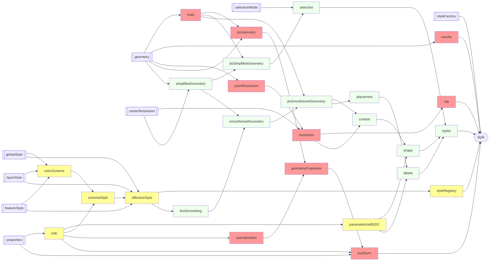

```mermaid
graph LR;

classDef common fill:#ff9;
classDef graphics fill:#f99;
classDef polygon fill:#efe;

%% Inputs
properties[[properties]];
geometry[[geometry]];
globalStyle[[globalStyle]];
layerStyle[[layerStyle]];
featureStyle[[featureStyle]];
centerResolution[[centerResolution]];
selectionMode[[selectionMode]];

styleFactory[[styleFactory]];

%% Common
properties --> sidc:::common;
sidc --> parameterizedSIDC:::common;
globalStyle --> colorScheme:::common;
layerStyle --> colorScheme;
featureStyle --> colorScheme;
sidc --> schemeStyle:::common;
colorScheme --> schemeStyle;
globalStyle --> effectiveStyle:::common;
schemeStyle --> effectiveStyle;
layerStyle --> effectiveStyle;
featureStyle --> effectiveStyle;
effectiveStyle --> styleRegistry:::common;

%% Graphics
geometry --> read:::graphics;
geometry --> rewrite:::graphics;
geometry --> pointResolution:::graphics;
centerResolution --> resolution:::graphics;
pointResolution --> resolution;
geometry --> jtsGeometry:::graphics;
read --> jtsGeometry;
resolution --> clip:::graphics;
sidc --> specialization:::graphics;
specialization --> geometryProperties:::graphics;
jtsGeometry --> geometryProperties;
sidc --> evalSync:::graphics;
properties --> evalSync;
geometryProperties --> evalSync;

%% Polygon
geometry --> simplifiedGeometry:::polygon;
centerResolution --> simplifiedGeometry;
simplifiedGeometry --> jtsSimplifiedGeometry:::polygon;
read --> jtsSimplifiedGeometry;
effectiveStyle --> lineSmoothing:::polygon;
simplifiedGeometry --> smoothenedGeometry:::polygon;
lineSmoothing --> smoothenedGeometry;
smoothenedGeometry --> jtsSmoothenedGeometry:::polygon;
read --> jtsSmoothenedGeometry;
jtsSmoothenedGeometry --> context:::polygon;
resolution --> context;
jtsSmoothenedGeometry --> placement:::polygon;
context --> shape:::polygon;
parameterizedSIDC --> shape;
selectionMode --> selection:::polygon;
jtsSimplifiedGeometry --> selection;
parameterizedSIDC --> labels:::polygon;
placement --> labels;
shape --> styles:::polygon;
labels --> styles;
selection --> styles;

%% Final
A{{style}}
styles --> A;
styleRegistry --> A;
evalSync --> A;
clip --> A;
rewrite --> A;
styleFactory --> A;
```